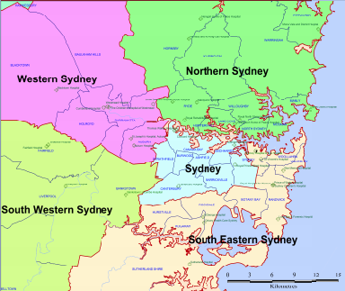

```{r setup, include=FALSE}
options(scipen=999, expressions=50000, 
        DT.options = list(pageLength = 8,
                          scrollX = TRUE,
                          dom = 'Bfrtip',
                          buttons = c('copy', 'csv', 'excel', 'pdf', 'print'), 
                          autoWidth = TRUE)) 

knitr::opts_chunk$set(echo = T, message=F, warning=F, fig.width=9.5, fig.height=4)
knitr::opts_knit$set(dev.args = list(type = "cairo"), progress=FALSE)
```

```{r}
# source("utility.R")
source("R_functions.R")
source("R_data_prepocessing.R")
```

# Base line
## Adjacent POA lockdown

```{r, fig.width=9.5, fig.height=4.3}
grid.arrange(
data.frame(POA_NAME16 = "2145", Total_cases = 25) %>% 
  bind_rows(SYD_POA_link %>% 
              filter(target == "2145") %>% 
              select(-target) %>% 
              rename(POA_NAME16 = source) %>% 
              # mutate(Total_cases = 0)
              mutate(Total_cases = round(runif(nrow(.),1,10)))
            ) %>%
  bind_rows(data.frame(
    POA_NAME16 = c("2747", "2155", "2170", "2176"),
    Total_cases = c(5,8,5,3)
  )) %>% 
  plot_map_TL(rmapshaper::ms_simplify(SYD_POA, .01), 
              "POA_NAME16", "Total_cases",
              "Simulated outbreak of Covid-19 \nfrom Western Sydney", 
              show_count = T, label_size = 3.5, return_obj = "map") + 
  xlim(150.7,151.2) + ylim(-34,-33.6)
,
data.frame(POA_NAME16 = "2145", Total_cases = 25) %>% 
  bind_rows(SYD_POA_link %>% 
              filter(target == "2145") %>% 
              select(-target) %>% 
              rename(POA_NAME16 = source) %>% 
              # mutate(Total_cases = 0)
              mutate(Total_cases = round(runif(nrow(.),1,10)))
            ) %>%
  mutate(lockdown_status = "Lockdown") %>% 
  # mutate(lockdown = ifelse(POA_NAME16 == VIRUS_ORIGIN,))
  plot_map_factor_TL(rmapshaper::ms_simplify(SYD_POA, .01), 
              "POA_NAME16", "Total_cases", "lockdown_status", 
              "Adjacent POA lockdown strategy \n(i.e. surrounding postal areas)", 
              na_factor = "No lockdown", map_lp = c(.15,.13), 
              show_count = F, label_size = 3.5, return_obj = "map") + 
  # theme_classic()
  xlim(150.7,151.2) + ylim(-34,-33.6)
, ncol=2)
```

* Mean number of adjacent POA = `r mean(SYD_POA_adjacency$n_adjacent_postcode)`
* Median number of adjacent POA = `r median(SYD_POA_adjacency$n_adjacent_postcode)`

```{r, fig.height=4, fig.width=7}
# hist(SYD_POA_adjacency$n_adjacent_postcode)
SYD_POA_adjacency %>%
  ggplot(aes(x=n_adjacent_postcode)) +
  geom_histogram() +
  labs(subtitle = "Histogram of number of adjacent postcode") + 
  annotate("text", x=9, y=40,
           label=paste0("Mean = ", 
                        round(mean(SYD_POA_adjacency$n_adjacent_postcode),1), 
                        "\nMedian = ", 
                        median(SYD_POA_adjacency$n_adjacent_postcode))) + 
  ggl()
```


## LGA lockdown

```{r, fig.width=10, fig.height=7}
confirmed_cases %>% 
  filter(lga_name19 %in% SYD_LGA$LGA_NAME19) %>% 
  count(lga_name19, name="Total_cases") %>% 
  rename(LGA_NAME19 = lga_name19) %>% 
  mutate(LGA_NAME19 = fct_reorder(LGA_NAME19, Total_cases)) %>% 
  plot_map_TL(SYD_LGA, "LGA_NAME19", "Total_cases", 
           "Total Covid-19 cases by LGA (SYD)", 
           border_size = .3, show_count = T)
```
## LHD lockdown



[Sourced from https://www.health.nsw.gov.au/lhd/Documents/lhd-wall-map.pdf](https://www.health.nsw.gov.au/lhd/Documents/lhd-wall-map.pdf)

## Effectiveness

Key assumption: Areas under lock-down would __NOT__ incur new Covid-19 cases in the 14 days following the first outbreak. This is just a vehicle to compare the effectiveness of different lock-down strategies - we can relax the assumtion to e.g. 50% of the cases in the 14 days following the first outbreak can be avoided. 

```{r, fig.height=3, fig.width=6}
baseline_cases %>%
  summarise(across(contains("avoided"), mean)) %>% 
  gather() %>% 
  ggplot(aes(x=key, y=value)) + 
  geom_col() + 
  geom_text(aes(label = paste0(round(100*value,1), "%")), 
            col="white", hjust="inward") + 
  labs(subtitle = "% share of cases avoided by \nbaseline lockdown stragegies") + 
  ggy(percent, name="") + 
  xlab("") + 
  coord_flip() + 
  ggl(base_size=14)
```

```{r, fig.height=3, fig.width=5}
baseline_cases %>% 
  filter(as.character(postcode) %in% SYD_POA$POA_NAME16) %>% 
  summarise(n_POA = n_distinct(postcode), 
            n_lga = n_distinct(lga_name19), 
            n_lhd = n_distinct(lhd_2010_name)) %>% 
  gather() %>% 
  
  ggplot(aes(x=reorder(key, value), y=value, label=value)) + 
  geom_col() + 
  geom_text(col="black", hjust=0, nudge_y = 3) + 
  coord_flip() + 
  xlab("") + ylab("") + 
  ylim(c(0,210)) +
  labs(subtitle = "Number of elements in the Sydney geography") + 
  ggl()
```

# Challenger
## Census (Homophily) cluster

```{r, fig.height=5, fig.width=8}
baseline_cases %>%
  mutate(avoided_by_kcluster_lockdown = 
           check_avoided_cases(case_df = baseline_cases, 
                               cluster_df = census_clusters, 
                               cluster_var = "kcluster")) %>% 
  mutate(avoided_by_hcluster_lockdown = 
           check_avoided_cases(case_df = baseline_cases, 
                               cluster_df = census_clusters, 
                               cluster_var = "hcluster")) %>% 
  
  summarise(across(contains("avoided"), mean)) %>% 
  gather() %>% 
  mutate(key = fct_reorder(key, value)) %>% 
  mutate(fill_var = ifelse(str_detect(key, "(lhd|lga|adjacent|syd)"), 
                                      "benchmark", "challenger")) %>% 
  ggplot(aes(x=key, y=value, fill=fill_var)) + 
  geom_col() + 
  geom_text(aes(label = paste0(round(100*value,1), "%")), 
            col="white", hjust="inward", size=4) + 
  scale_fill_brewer(palette = "Dark2") +
  labs(subtitle = "% share of cases avoided by lockdown stragegies") + 
  ggy(percent, name="") + 
  xlab("") + 
  coord_flip() + 
  ggl(base_size=14)
```

```{r, fig.width=9.5, fig.height=7}
census_feature_by_POA %>% 
  mutate(POA_NAME16 = as.character(POA_CODE_2016)) %>% 
  mutate(POA_NAME16 = fct_reorder(POA_NAME16, high_income)) %>% 
  plot_map_TL(SYD_POA, "POA_NAME16", "high_income", 
           "high_income by POA (SYD)", 
           show_count = F, label_size = 2)
```

## Gravity Top X Rule 

```{r, fig.height=5.3, fig.width=8}
SYD_POA_gravity %>% 
  group_by(source) %>% 
  slice_max(gravity, n = 5, with_ties=FALSE) %>% 
  select(-gravity) %>% 
  nest(gravity_postcode = target) %>% 
  mutate(gravity_postcode = map(gravity_postcode, ~.x[[1]])) %>% 
  # mutate(n_adjacent_postcode = map_dbl(adjacent_postcode, length))
  
  ungroup() %>% 
  right_join(baseline_cases, by=c("source"="postcode")) %>% 
  mutate(avoided_by_gravity_lockdown = map2_lgl(
    notification_date, gravity_postcode, function(x, y) {
      confirmed_cases %>% 
        filter(notification_date < x, 
               notification_date >= x - 14) %>% 
        filter(postcode %in% y) %>% 
        nrow(.) -> n_gravity_case_within14days
      n_gravity_case_within14days > 0
    }
  )) %>% 
  # summarise(mean(avoided_by_gravity_lockdown))
  
  mutate(avoided_by_kcluster_lockdown = 
           check_avoided_cases(case_df = baseline_cases, 
                               cluster_df = census_clusters, 
                               cluster_var = "kcluster")) %>% 
  mutate(avoided_by_hcluster_lockdown = 
           check_avoided_cases(case_df = baseline_cases, 
                               cluster_df = census_clusters, 
                               cluster_var = "hcluster")) %>% 
  
  summarise(across(contains("avoided"), mean)) %>% 
  gather() %>% 
  mutate(key = fct_reorder(key, value)) %>% 
  mutate(fill_var = ifelse(str_detect(key, "(lhd|lga|adjacent|syd)"), 
                                      "benchmark", "challenger")) %>% 
  ggplot(aes(x=key, y=value, fill=fill_var)) + 
  geom_col() + 
  geom_text(aes(label = paste0(round(100*value,1), "%")), 
            col="white", hjust="inward", size=4) + 
  scale_fill_brewer(palette = "Dark2") +
  labs(subtitle = "% share of cases avoided by lockdown stragegies") + 
  ggy(percent, name="") + 
  xlab("") + 
  coord_flip() + 
  ggl(base_size=14)
```

## Homophily Gravity

```{r, fig.height=5.5, fig.width=8}
SYD_POA_gravity_census %>% 
  group_by(source) %>% 
  slice_max(gravity, n = 5, with_ties = FALSE) %>% 
  select(-gravity) %>% 
  nest(gravity_postcode = target) %>% 
  mutate(gravity_postcode = map(gravity_postcode, ~.x[[1]])) %>% 
  # mutate(n_adjacent_postcode = map_dbl(adjacent_postcode, length))
  
  ungroup() %>% 
  right_join(baseline_cases, by=c("source"="postcode")) %>% 
  mutate(avoided_by_gravity_lockdown = map2_lgl(
    notification_date, gravity_postcode, function(x, y) {
      confirmed_cases %>% 
        filter(notification_date < x, 
               notification_date >= x - 14) %>% 
        filter(postcode %in% y) %>% 
        nrow(.) -> n_gravity_case_within14days
      n_gravity_case_within14days > 0
    }
  )) %>% 
  # summarise(mean(avoided_by_gravity_lockdown))
  
  mutate(avoided_by_kcluster_lockdown = 
           check_avoided_cases(case_df = baseline_cases, 
                               cluster_df = census_clusters, 
                               cluster_var = "kcluster")) %>% 
  mutate(avoided_by_hcluster_lockdown = 
           check_avoided_cases(case_df = baseline_cases, 
                               cluster_df = census_clusters, 
                               cluster_var = "hcluster")) %>% 
  
  summarise(across(contains("avoided"), mean)) %>% 
  gather() %>% 
  mutate(key = fct_reorder(key, value)) %>% 
  mutate(fill_var = ifelse(str_detect(key, "(lhd|lga|adjacent|syd)"), 
                                      "benchmark", "challenger")) %>% 
  ggplot(aes(x=key, y=value, fill=fill_var)) + 
  geom_col() + 
  geom_text(aes(label = paste0(round(100*value,1), "%")), 
            col="white", hjust="inward", size=4) + 
  scale_fill_brewer(palette = "Dark2") +
  labs(subtitle = "% share of cases avoided by lockdown stragegies") + 
  ggy(percent, name="") + 
  xlab("") + 
  coord_flip() + 
  ggl(base_size=14)
```

## Gravity cluster

```{r, fig.height=6, fig.width=8}

baseline_cases %>% 
  mutate(avoided_by_census_kcluster_lockdown = 
           check_avoided_cases(case_df = baseline_cases, 
                               cluster_df = census_clusters, 
                               cluster_var = "kcluster")) %>% 
  mutate(avoided_by_census_hcluster_lockdown = 
           check_avoided_cases(case_df = baseline_cases, 
                               cluster_df = census_clusters, 
                               cluster_var = "hcluster")) %>% 
  mutate(avoided_by_combined_kcluster_lockdown = 
           check_avoided_cases(case_df = baseline_cases, 
                               cluster_df = combined_clusters, 
                               cluster_var = "kcluster")) %>% 
  mutate(avoided_by_combined_hcluster_lockdown = 
           check_avoided_cases(case_df = baseline_cases, 
                               cluster_df = combined_clusters, 
                               cluster_var = "hcluster")) %>% 
  mutate(avoided_by_gravity_kcluster_lockdown = 
           check_avoided_cases(case_df = baseline_cases, 
                               cluster_df = gravity_clusters, 
                               cluster_var = "kcluster")) %>% 
  mutate(avoided_by_gravity_hcluster_lockdown = 
           check_avoided_cases(case_df = baseline_cases, 
                               cluster_df = gravity_clusters, 
                               cluster_var = "hcluster")) %>% 
  
  summarise(across(contains("avoided"), mean)) %>% 
  gather() %>% 
  mutate(key = fct_reorder(key, value)) %>% 
  mutate(fill_var = ifelse(str_detect(key, "(lhd|lga|adjacent|syd)"), 
                                      "benchmark", "challenger")) %>% 
  ggplot(aes(x=key, y=value, fill=fill_var)) + 
  geom_col() + 
  geom_text(aes(label = paste0(round(100*value,1), "%")), 
            col="white", hjust="inward", size=4) + 
  scale_fill_brewer(palette = "Dark2") +
  labs(subtitle = "% share of cases avoided by lockdown stragegies") + 
  ggy(percent, name="") + 
  xlab("") + 
  coord_flip() + 
  ggl(base_size=14)
```

```{r, fig.width=10, fig.height=7}
combined_feature_by_POA %>% 
  mutate(gravity = round(gravity)) %>% 
  mutate(gravity = ifelse( POA_CODE_2016 == 2000, gravity/1.6, gravity)) %>% 
  mutate(POA_NAME16 = as.character(POA_CODE_2016)) %>% 
  mutate(POA_NAME16 = fct_reorder(POA_NAME16, gravity)) %>% 
  plot_map_TL(SYD_POA, "POA_NAME16", "gravity", 
           "Total gravity by POA_NAME16 (SYD)", 
           border_size = .3, show_count = F)
```

```{r, fig.width=10, fig.height=7}
confirmed_cases %>%
  filter(as.character(postcode) %in% SYD_POA$POA_NAME16) %>%
  count(postcode, name="Total_cases") %>%
  mutate(POA_NAME16 = as.character(postcode)) %>% 
  left_join(
    gravity_clusters
    # bind_cols(
    #   combined_feature_by_POA[,2] %>% 
    #     helper_clustering(k=5) %>% pull(cluster) %>% as.factor(), 
    #   combined_feature_by_POA[,2] %>% 
    #     helper_h_clustering(k=5) %>% pull(cluster) %>% as.factor()
    # ) %>% 
    #   as_tibble() %>% 
    #   `colnames<-`(c("kcluster", "hcluster")) %>% 
    #   bind_cols(combined_feature_by_POA[,1]) %>% 
    #   mutate(POA_NAME16 = as.character(POA_CODE_2016)) %>% 
    #   select(POA_NAME16, kcluster, hcluster) 
            , by=c("POA_NAME16"="POA_NAME16")) %>%
  mutate(POA_NAME16 = fct_reorder(as.factor(POA_NAME16), Total_cases)) %>%
  plot_map_factor_TL(SYD_POA, "POA_NAME16", "Total_cases", "hcluster",
                     "Total Covid-19 cases by POA (SYD), highlighted by gravity cluster",
                     show_count = T, label_size = 2)
```

```{r, fig.height=6, fig.width=8}

baseline_cases %>% 
  filter(notification_date >= ymd(20200701), 
         notification_date <= ymd(20201001)) %>% 
  mutate(avoided_by_census_kcluster_lockdown = 
           check_avoided_cases(case_df = baseline_cases %>% 
  filter(notification_date >= ymd(20200701), 
         notification_date <= ymd(20201001)), 
                               cluster_df = census_clusters, 
                               cluster_var = "kcluster")) %>% 
  mutate(avoided_by_census_hcluster_lockdown = 
           check_avoided_cases(case_df = baseline_cases %>% 
  filter(notification_date >= ymd(20200701), 
         notification_date <= ymd(20201001)), 
                               cluster_df = census_clusters, 
                               cluster_var = "hcluster")) %>% 
  mutate(avoided_by_combined_kcluster_lockdown = 
           check_avoided_cases(case_df = baseline_cases %>% 
  filter(notification_date >= ymd(20200701), 
         notification_date <= ymd(20201001)), 
                               cluster_df = combined_clusters, 
                               cluster_var = "kcluster")) %>% 
  mutate(avoided_by_combined_hcluster_lockdown = 
           check_avoided_cases(case_df = baseline_cases %>% 
  filter(notification_date >= ymd(20200701), 
         notification_date <= ymd(20201001)), 
                               cluster_df = combined_clusters, 
                               cluster_var = "hcluster")) %>% 
  mutate(avoided_by_gravity_kcluster_lockdown = 
           check_avoided_cases(case_df = baseline_cases %>% 
  filter(notification_date >= ymd(20200701), 
         notification_date <= ymd(20201001)), 
                               cluster_df = gravity_clusters, 
                               cluster_var = "kcluster")) %>% 
  mutate(avoided_by_gravity_hcluster_lockdown = 
           check_avoided_cases(case_df = baseline_cases %>% 
  filter(notification_date >= ymd(20200701), 
         notification_date <= ymd(20201001)), 
                               cluster_df = gravity_clusters, 
                               cluster_var = "hcluster")) %>% 
  
  summarise(across(contains("avoided"), mean)) %>% 
  gather() %>% 
  mutate(key = fct_reorder(key, value)) %>% 
  mutate(fill_var = ifelse(str_detect(key, "(lhd|lga|adjacent)"), 
                                      "benchmark", "challenger")) %>% 
  ggplot(aes(x=key, y=value, fill=fill_var)) + 
  geom_col() + 
  geom_text(aes(label = paste0(round(100*value,1), "%")), 
            col="white", hjust="inward", size=4) + 
  scale_fill_brewer(palette = "Dark2") +
  labs(subtitle = "% share of cases avoided by lockdown stragegies \n(Western SYD cluster july to Oct, 2020)") + 
  ggy(percent, name="") + 
  xlab("") + 
  coord_flip() + 
  ggl(base_size=14)
```

## Gravity & Cluster hybrid

```{r, fig.height=5.8, fig.width=8}
SYD_POA_gravity %>% 
  group_by(source) %>% 
  slice_max(gravity, n = 5, with_ties=FALSE) %>% 
  select(-gravity) %>% 
  nest(gravity_postcode = target) %>% 
  mutate(gravity_postcode = map(gravity_postcode, ~.x[[1]])) %>% 
  # mutate(n_adjacent_postcode = map_dbl(adjacent_postcode, length))
  
  ungroup() %>% 
  right_join(baseline_cases, by=c("source"="postcode")) %>% 
  mutate(avoided_by_gravity_lockdown = map2_lgl(
    notification_date, gravity_postcode, function(x, y) {
      confirmed_cases %>% 
        filter(notification_date < x, 
               notification_date >= x - 14) %>% 
        filter(postcode %in% y) %>% 
        nrow(.) -> n_gravity_case_within14days
      n_gravity_case_within14days > 0
    }
  )) %>% 
  # summarise(mean(avoided_by_gravity_lockdown))
  
  mutate(avoided_by_census_kcluster_lockdown = 
           check_avoided_cases(case_df = baseline_cases, 
                               cluster_df = census_clusters, 
                               cluster_var = "kcluster")) %>% 
  mutate(avoided_by_census_hcluster_lockdown = 
           check_avoided_cases(case_df = baseline_cases, 
                               cluster_df = census_clusters, 
                               cluster_var = "hcluster")) %>% 
  
  mutate(avoided_by_combined_kcluster_lockdown = 
           check_avoided_cases(case_df = baseline_cases, 
                               cluster_df = combined_clusters, 
                               cluster_var = "kcluster")) %>% 
  mutate(avoided_by_combined_hcluster_lockdown = 
           check_avoided_cases(case_df = baseline_cases, 
                               cluster_df = combined_clusters, 
                               cluster_var = "hcluster")) %>% 
  
  mutate(avoided_by_hybrid_lockdown = avoided_by_gravity_lockdown | avoided_by_census_kcluster_lockdown | avoided_by_census_hcluster_lockdown) %>% 
  
  summarise(across(contains("avoided"), mean)) %>% 
  gather() %>% 
  mutate(key = fct_reorder(key, value)) %>% 
  mutate(fill_var = ifelse(str_detect(key, "(lhd|lga|adjacent|syd)"), 
                                      "benchmark", "challenger")) %>% 
  ggplot(aes(x=key, y=value, fill=fill_var)) + 
  geom_col() + 
  geom_text(aes(label = paste0(round(100*value,1), "%")), 
            col="white", hjust="inward", size=4) + 
  scale_fill_brewer(palette = "Dark2") +
  labs(subtitle = "% share of cases avoided by lockdown stragegies") + 
  ggy(percent, name="") +
  xlab("") + 
  coord_flip() + 
  ggl(base_size=14)
```

# Avoided cases mapping
## Total cases

```{r, fig.width=9.5, fig.height=7}
confirmed_cases %>% 
  filter(as.character(postcode) %in% SYD_POA$POA_NAME16) %>% 
  count(postcode, name="Total_cases") %>% 
  rename(POA_NAME16 = postcode) %>% 
  mutate(POA_NAME16 = fct_reorder(as.factor(POA_NAME16), Total_cases)) %>% 
  plot_map_TL(SYD_POA, "POA_NAME16", "Total_cases", 
           "Total Covid-19 cases by POA (SYD)", 
           show_count = T, label_size = 3)
```

## lga lockdown

```{r, fig.width=9.5, fig.height=7}
baseline_cases %>%
  filter(avoided_by_lga_lockdown) %>% 
  count(postcode, name="Total_avoided_cases") %>% 
  rename(POA_NAME16 = postcode) %>% 
  mutate(POA_NAME16 = fct_reorder(as.factor(POA_NAME16), 
                                  Total_avoided_cases)) %>% 
  plot_map_TL(SYD_POA, "POA_NAME16", "Total_avoided_cases", 
           "Total avoided cases by adjacent lockdown (SYD)", 
           show_count = T, label_size = 3, fill_col = "darkgreen")
```

## adjacent lockdown

```{r, fig.width=9.5, fig.height=7}
baseline_cases %>%
  filter(avoided_by_adjacent_lockdown) %>% 
  count(postcode, name="Total_avoided_cases") %>% 
  rename(POA_NAME16 = postcode) %>% 
  mutate(POA_NAME16 = fct_reorder(as.factor(POA_NAME16), 
                                  Total_avoided_cases)) %>% 
  plot_map_TL(SYD_POA, "POA_NAME16", "Total_avoided_cases", 
           "Total avoided cases by adjacent lockdown (SYD)", 
           show_count = T, label_size = 3, fill_col = "grey23")
```

## census hcluster lockdown

```{r, fig.width=9.5, fig.height=7}
baseline_cases %>%
  mutate(avoided_by_hcluster_lockdown = 
           check_avoided_cases(case_df = baseline_cases, 
                               cluster_df = census_clusters, 
                               cluster_var = "hcluster")) %>% 
  filter(avoided_by_hcluster_lockdown) %>% 
  count(postcode, name="Total_avoided_cases") %>% 
  rename(POA_NAME16 = postcode) %>% 
  mutate(POA_NAME16 = fct_reorder(as.factor(POA_NAME16), 
                                  Total_avoided_cases)) %>% 
  plot_map_TL(SYD_POA, "POA_NAME16", "Total_avoided_cases", 
           "Total avoided cases by census hcluster lockdown (SYD)", 
           show_count = T, label_size = 3, fill_col = "darkgreen")
```

## gravity top 5 lockdown

```{r, fig.width=9.5, fig.height=7}
SYD_POA_gravity %>% 
  group_by(source) %>% 
  slice_max(gravity, n = 5, with_ties=FALSE) %>% 
  select(-gravity) %>% 
  nest(gravity_postcode = target) %>% 
  mutate(gravity_postcode = map(gravity_postcode, ~.x[[1]])) %>% 
  # mutate(n_adjacent_postcode = map_dbl(adjacent_postcode, length))
  
  ungroup() %>% 
  right_join(baseline_cases, by=c("source"="postcode")) %>% 
  mutate(avoided_by_gravity_lockdown = map2_lgl(
    notification_date, gravity_postcode, function(x, y) {
      confirmed_cases %>% 
        filter(notification_date < x, 
               notification_date >= x - 14) %>% 
        filter(postcode %in% y) %>% 
        nrow(.) -> n_gravity_case_within14days
      n_gravity_case_within14days > 0
    }
  )) %>% 
  filter(avoided_by_gravity_lockdown) %>% 
  rename(postcode = source) %>% 
  count(postcode, name="Total_avoided_cases") %>% 
  rename(POA_NAME16 = postcode) %>% 
  mutate(POA_NAME16 = fct_reorder(as.factor(POA_NAME16), 
                                  Total_avoided_cases)) %>% 
  plot_map_TL(SYD_POA, "POA_NAME16", "Total_avoided_cases", 
           "Total avoided cases by gravity lockdown (SYD)", 
           show_count = T, label_size = 3, fill_col = "darkblue")
```

# Number of POA days in lockdown

```{r}
baseline_and_challenger_cases <- SYD_POA_gravity %>% 
  group_by(source) %>% 
  slice_max(gravity, n = 5, with_ties=FALSE) %>% 
  select(-gravity) %>% 
  nest(gravity_postcode = target) %>% 
  mutate(gravity_postcode = map(gravity_postcode, ~.x[[1]])) %>% 
  # mutate(n_adjacent_postcode = map_dbl(adjacent_postcode, length))
  
  ungroup() %>% 
  right_join(baseline_cases, by=c("source"="postcode")) %>% 
  mutate(avoided_by_gravity_lockdown = map2_lgl(
    notification_date, gravity_postcode, function(x, y) {
      confirmed_cases %>% 
        filter(notification_date < x, 
               notification_date >= x - 14) %>% 
        filter(postcode %in% y) %>% 
        nrow(.) -> n_gravity_case_within14days
      n_gravity_case_within14days > 0
    }
  )) %>% 
  
  mutate(avoided_by_census_kcluster_lockdown = 
           check_avoided_cases(case_df = baseline_cases, 
                               cluster_df = census_clusters, 
                               cluster_var = "kcluster")) %>% 
  mutate(avoided_by_census_hcluster_lockdown = 
           check_avoided_cases(case_df = baseline_cases, 
                               cluster_df = census_clusters, 
                               cluster_var = "hcluster")) %>% 
  
  mutate(avoided_by_combined_kcluster_lockdown = 
           check_avoided_cases(case_df = baseline_cases, 
                               cluster_df = combined_clusters, 
                               cluster_var = "kcluster")) %>% 
  mutate(avoided_by_combined_hcluster_lockdown = 
           check_avoided_cases(case_df = baseline_cases, 
                               cluster_df = combined_clusters, 
                               cluster_var = "hcluster")) %>% 
  
  mutate(avoided_by_hybrid_lockdown = avoided_by_gravity_lockdown | avoided_by_census_kcluster_lockdown | avoided_by_census_hcluster_lockdown) %>% 
  
  left_join(census_clusters %>% 
              `colnames<-`(c("source",
                             "census_kcluster", "census_hcluster")), 
            by="source") %>% 
  left_join(combined_clusters %>% 
              `colnames<-`(c("source",
                             "combined_kcluster", 
                             "combined_hcluster")), 
            by="source")
```

```{r}
baseline_and_challenger_cases %>% 
  filter(avoided_by_census_hcluster_lockdown) %>% 
  left_join(
    census_clusters %>% count(census_hcluster = kcluster)
  , by="census_hcluster") %>% 
  summarise(sum(n, na.rm=T))

baseline_and_challenger_cases %>% 
  filter(avoided_by_combined_kcluster_lockdown) %>% 
  left_join(
    combined_clusters %>% count(combined_kcluster = kcluster)
  , by="combined_kcluster") %>% 
  summarise(sum(n, na.rm=T))
```


# Tune lockdown period

```{r}
turn_lockdown_period_result <- list()
for (N_LOCKDOWN in 1:20) {
  turn_lockdown_period_result[[N_LOCKDOWN]] <- confirmed_cases %>%
  mutate(postcode = as.character(postcode)) %>% 
  # --------------join adjacent POS------------------
  left_join(SYD_POA_adjacency, by="postcode") %>% 
  select(notification_date, postcode, adjacent_postcode, 
         lga_name19, lhd_2010_name) %>% 
  # --------------------------------------------
  arrange(notification_date, postcode) %>% 
  mutate(case = 1:nrow(.)) %>% 
  # ----add indicator of cases avoided by adjacent POA cases within 14 days----
  mutate(avoided_by_adjacent_lockdown = map2_lgl(
    notification_date, adjacent_postcode, function(x, y) {
      confirmed_cases %>% 
        filter(notification_date < x, 
               notification_date >= x - N_LOCKDOWN) %>% 
        filter(postcode %in% y) %>% 
        nrow(.) -> n_adjacent_case_within14days
      n_adjacent_case_within14days > 0
    }
  )) %>% 
  # ---add indicator of cases avoided by LGA cases within 14 days------
mutate(avoided_by_lga_lockdown = map2_lgl(
  notification_date, lga_name19, function(x, y) {
    confirmed_cases %>% 
      filter(notification_date < x, 
             notification_date >= x - N_LOCKDOWN) %>% 
      filter(lga_name19 == y) %>% 
      nrow(.) -> n_lga_case_within14days
    n_lga_case_within14days > 0
  }
)) %>% 
# ---add indicator of cases avoided by LHD cases within 14 days------
mutate(avoided_by_lhd_lockdown = map2_lgl(
  notification_date, lhd_2010_name, function(x, y) {
    confirmed_cases %>% 
      filter(notification_date < x, 
             notification_date >= x - N_LOCKDOWN) %>% 
      filter(lhd_2010_name == y) %>% 
      nrow(.) -> n_lhd_case_within14days
    n_lhd_case_within14days > 0
  }
)) %>% 
  # ---add indicator of cases avoided by SYD cases within 14 days------
mutate(avoided_by_syd_lockdown = map_lgl(
  notification_date, function(x, y) {
    confirmed_cases %>% 
      filter(notification_date < x, 
             notification_date >= x - N_LOCKDOWN) %>% 
      # filter(lhd_2010_name == y) %>% 
      nrow(.) -> n_syd_case_within14days
    n_syd_case_within14days > 0
  }
)) %>% 
# ---add indicator of cases avoided by clustering ------
  mutate(avoided_by_census_kcluster_lockdown = 
           check_avoided_cases(n=N_LOCKDOWN, 
                               case_df = baseline_cases, 
                               cluster_df = census_clusters, 
                               cluster_var = "kcluster")) %>% 
  mutate(avoided_by_census_hcluster_lockdown = 
           check_avoided_cases(n=N_LOCKDOWN, 
                               case_df = baseline_cases, 
                               cluster_df = census_clusters, 
                               cluster_var = "hcluster")) %>% 
  
  mutate(avoided_by_combined_kcluster_lockdown = 
           check_avoided_cases(n=N_LOCKDOWN, 
                               case_df = baseline_cases, 
                               cluster_df = combined_clusters, 
                               cluster_var = "kcluster")) %>% 
  mutate(avoided_by_combined_hcluster_lockdown = 
           check_avoided_cases(n=N_LOCKDOWN, 
                               case_df = baseline_cases, 
                               cluster_df = combined_clusters, 
                               cluster_var = "hcluster")) %>% 
# ----add indicator of cases avoided by gravity rule ----------
  left_join(
    SYD_POA_gravity %>% 
    group_by(source) %>% 
    slice_max(gravity, n = 5, with_ties=FALSE) %>% 
    select(-gravity) %>% 
    nest(gravity_postcode = target) %>% 
    mutate(gravity_postcode = map(gravity_postcode, ~.x[[1]])) %>% 
    # mutate(n_adjacent_postcode = map_dbl(adjacent_postcode, length))
    ungroup()
  , by = c("postcode"="source")) %>% 
  mutate(avoided_by_gravity_lockdown = map2_lgl(
    notification_date, gravity_postcode, function(x, y) {
      confirmed_cases %>% 
        filter(notification_date < x, 
               notification_date >= x - N_LOCKDOWN) %>% 
        filter(postcode %in% y) %>% 
        nrow(.) -> n_gravity_case_within14days
      n_gravity_case_within14days > 0
    }
  ))
}

saveRDS(turn_lockdown_period_result, 
        "data/turn_lockdown_period_result.rds")
```

```{r, fig.width=8, fig.height=8}
grid.arrange(
turn_lockdown_period_result[1:20] %>% 
  map_dfr(function(df) {
    df %>% 
      summarise(across(contains("avoided"), mean)) %>% 
      mutate()
  }) %>% 
  mutate(n_lockdown_period = 1:20) %>% 
  select(-avoided_by_syd_lockdown,
         -avoided_by_lhd_lockdown, 
         -avoided_by_lga_lockdown) %>% 
  
  gather(key, value, -n_lockdown_period) %>% 
  mutate(lab = ifelse(n_lockdown_period == 20, 
                      str_extract(key, "(?<=by_).*"), "")) %>% 
  ggplot(aes(x=n_lockdown_period, y=value, col=key)) + 
  geom_line() + 
  geom_point(size=1) + 
  # geom_text_repel(aes(label=lab), nudge_x = 2) + 
  # xlim(c(0,25)) + 
  # facet_wrap(~key) + 
  ggy(percent, name="% of cases avoided by lockdown") + 
  ggl("right")
,
turn_lockdown_period_result[1:20] %>% 
  map_dfr(function(df) {
    df %>% 
      summarise(across(contains("avoided"), mean)) %>% 
      mutate()
  }) %>% 
  mutate(n_lockdown_period = 1:20) %>% 
  select(-avoided_by_syd_lockdown,
         -avoided_by_lhd_lockdown, 
         -avoided_by_lga_lockdown) %>% 
  
  gather(key, value, -n_lockdown_period) %>% 
  mutate(lab = ifelse(n_lockdown_period == 10, 
                      str_extract(key, "(?<=by_).*"), "")) %>% 
  ggplot(aes(x=n_lockdown_period, y=value, col=key)) + 
  geom_line() + 
  geom_point(size=1) + 
  geom_text(aes(label=lab, y=.5), nudge_x = 2) +
  # xlim(c(0,25)) + 
  facet_wrap(~key, nrow = 2) +
  ggy(percent, name="% of cases avoided by lockdown") + 
  ggl("none") + 
  theme(strip.background = element_blank(),
        strip.text.x = element_blank())
, heights = c(1,1))
```


